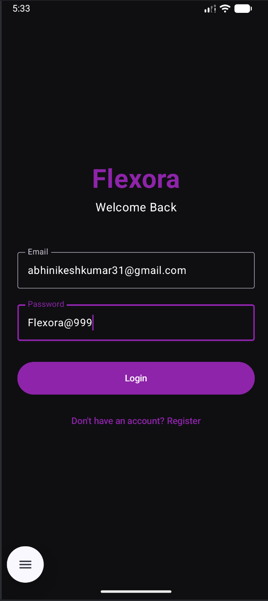
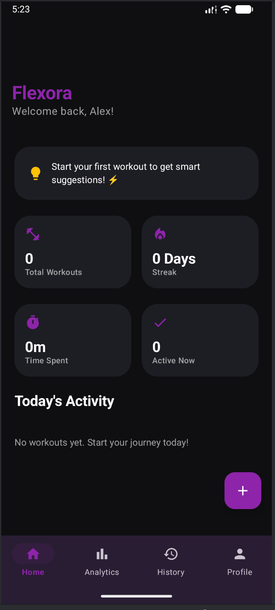
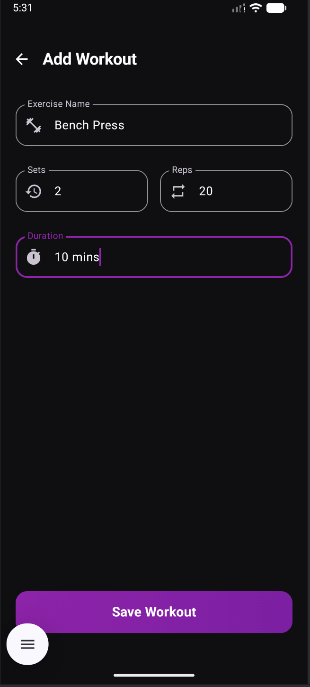
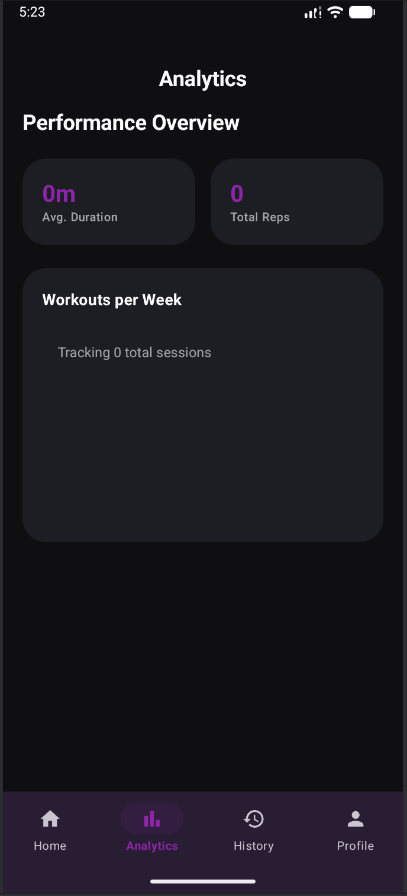
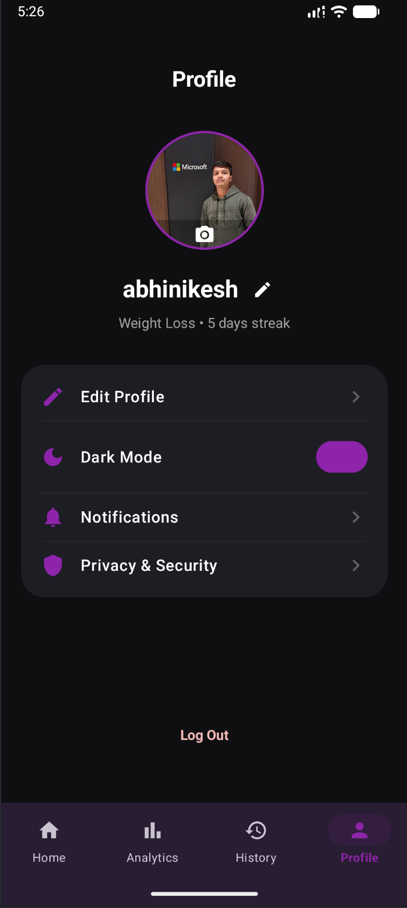

<div align="center">



# 💪 Flexora
### Smart Workout Tracker — Built for Athletes, Designed for Everyone


*Track your workouts. Build your streaks. Own your progress.*

</div>

---

## 📸 Screenshots

<div align="center">

| Login | Home | Add Workout | Analytics | Profile |
|-------|------|-------------|-----------|---------|
|  |  |  |  |  |

</div>

---

## 🚀 Features

### 🏠 Home Dashboard
- View total workouts completed
- Track daily streaks 🔥
- Monitor total time spent training
- Real-time activity updates via Flow

### ➕ Add Workout
- Add exercise name, sets, reps, and duration
- Input validation to prevent empty/invalid entries
- Data saved instantly to local Room Database

### 📊 Analytics
- Visual performance overview
- Average duration and total reps tracking
- Weekly workout frequency insights

### 🕒 History
- Browse all past workout sessions
- Real-time updates using Kotlin Flow
- Clean RecyclerView with smooth scrolling

### 👤 Profile
- Update username
- Change profile picture from gallery
- Persistent storage with SharedPreferences + Room

---

## 🛠️ Tech Stack

| Layer | Technology |
|-------|------------|
| Language | Kotlin |
| Architecture | MVVM (Model-View-ViewModel) |
| Database | Room Database |
| Async | Kotlin Coroutines + Flow |
| UI | XML + Material Design 3 |
| Navigation | Android Navigation Component |
| Dependency Injection | Hilt |

---

---

## ⚙️ How It Works

User adds workout
↓
Room Database stores it locally
↓
ViewModel observes DB via Kotlin Flow
↓
UI updates automatically in real-time
↓
Data persists even after app restart

---

## 🏃 Getting Started

### Prerequisites
- Android Studio Hedgehog or later
- Minimum SDK: 24
- Target SDK: 34
- Kotlin 1.9+

### Installation
```bash
# Clone the repository
git clone https://github.com/Abhinikesh/Flexora.git

# Open in Android Studio
# Let Gradle sync complete

# Run on emulator or physical device
```

---

## 🔥 Key Highlights

- ✅ **Offline-First** — Works 100% without internet using Room DB
- ✅ **Real-Time UI** — Kotlin Flow ensures instant UI updates
- ✅ **Clean Architecture** — MVVM with Repository pattern
- ✅ **Production-Ready** — Scalable folder structure with DI
- ✅ **Modern UI** — Material Design 3 with dark theme

---

## 🚀 Upcoming Features

- [ ] Firebase cloud sync for backup
- [ ] AI-based workout suggestions
- [ ] Calorie tracking system
- [ ] Dynamic dark/light theme toggle
- [ ] Social sharing and leaderboard
- [ ] Progress charts with MPAndroidChart

---

## 🧑‍💻 Author

<div align="center">

**Abhinikesh Kumar**
Android Developer | Kotlin Enthusiast

[](https://github.com/Abhinikesh)

</div>

---

## 📄 License

---

<div align="center">

Made with ❤️ using Kotlin & Android Studio

⭐ Star this repo if you found it helpful!

</div>
